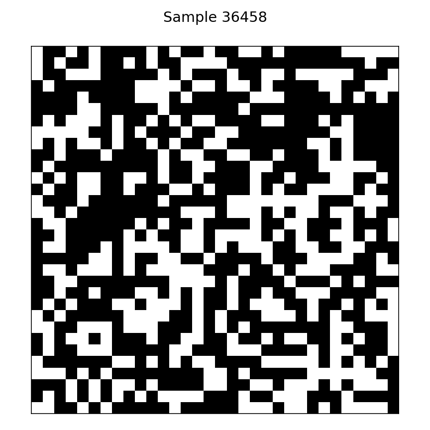
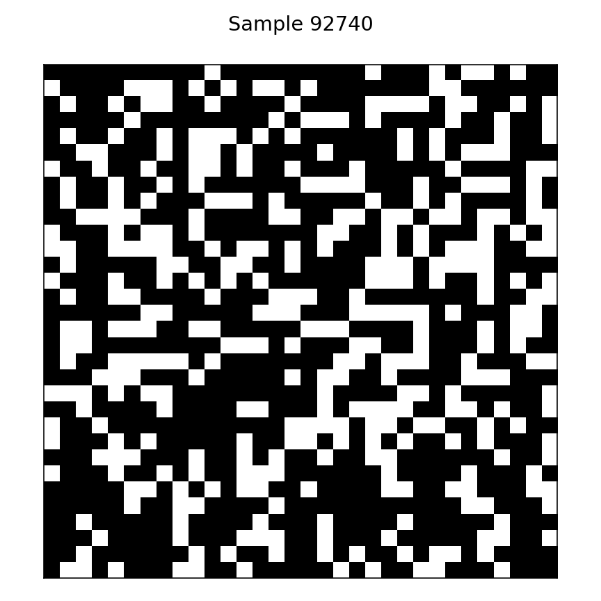

# Percolation Classification

The convolutional neural networks found in `src/model_L.py` were built to identify percolating clusters in 2D square lattices of size L = 4, 8, 16, 32.
The models were trained with data augmentation of reflecting vertically, reflecting horizontally, and transposing (because all of these augmentations leave the system's phase unchanged, but produce different orientations of percolating clusters allowing the model to generalize better).
All models perform extraordinarily well with test accuracies of >99.95%.
In the figure below we can see the test accuracy plotted against the site occupation probability p for the 32x32 lattice.


Ideally we would like to use models to try and determine where the percolation transition occurs, so the figure below shows the output probabilities (y_0 - not percolating, y_1 - percolating) of the model on test data.
It is also important to note that due to the stochastic nature of the way the data was generated, there are samples with p < p_c which have percolating clusters and samples with p > p_c which do not.
We observe that the curves of the predictions intersect at a point p < p_c for all lattice sizes, but as L increases we see the intersection move closer towards the critical probability p_c ≈ 0.59274.


Below are the results of the models:

```
L = 4
--------------------train set results--------------------
Samples              : 26999
Samples misclassified: 0
Accuracy             : 1.00000
--------------------valid set results--------------------
Samples              : 1501
Samples misclassified: 0
Accuracy             : 1.00000
--------------------test set results--------------------
Samples              : 1500
Samples misclassified: 0
Accuracy             : 1.00000


L = 8
--------------------train set results--------------------
Samples              : 53999
Samples misclassified: 0
Accuracy             : 1.00000
--------------------valid set results--------------------
Samples              : 3001
Samples misclassified: 0
Accuracy             : 1.00000
--------------------test set results--------------------
Samples              : 3000
Samples misclassified: 0
Accuracy             : 1.00000


L = 16
--------------------train set results--------------------
Samples              : 107999
Samples misclassified: 0
Accuracy             : 1.00000
--------------------valid set results--------------------
Samples              : 6001
Samples misclassified: 1
Accuracy             : 0.99983
Sample  4648
	Truth     : [0. 1.]
	Prediction: [0.6127852  0.38721475]
	p         : 0.63
--------------------test set results--------------------
Test samples         : 6000
Samples misclassified: 0
Accuracy             : 1.00000


L = 32
--------------------train set results--------------------
Samples              : 161999
Samples misclassified: 2
Accuracy             : 0.99999
Sample  36458
	Truth     : [0. 1.]
	Prediction: [0.66839653 0.33160344]
	p         : 0.602
Sample  92740
	Truth     : [1. 0.]
	Prediction: [0.49916616 0.50083387]
	p         : 0.64
--------------------valid set results--------------------
Samples              : 9001
Samples misclassified: 0
Accuracy             : 1.00000
--------------------test set results--------------------
Samples              : 9000
Samples misclassified: 0
Accuracy             : 1.00000
```

Below are visualizations of the 32x32 lattices that were misclassified.
Training sample 36458 was classified as not percolating when it actually was, whereas sample 92740 was classified as percolating when it actually wasn't.
Looking at the softmax output see that the probability for the correct classifications was non-negligible.



