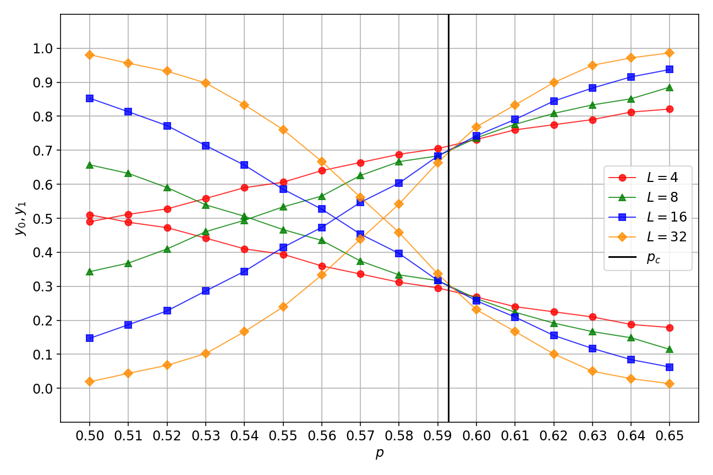

# Percolation Classification

The convolutional neural network found in `src/model_32.py` was built to identify percolating clusters in 2D square lattices of size 32x32.
It was trained on roughly 80k samples with data augmentation of reflecting vertically, reflecting horizontally, and transposing (because all of these augmentations leave the system's phase unchanged, but produce different orientations of percolating clusters allowing the model to generalize better).
For more information on the code see [src](src/).
It performs extraordinarily well with a test accuracy of >99.995%.
In the figure below we can see the test accuracy plotted against the site occupation probability p.


It is of interest to possibly use the model to determine where the percolation transition occurs, so the figure below shows the output probabilities (y_0 - not percolating, y_1 - percolating).
However, it is important to note that due to the stochastic nature of the way the data was generated, there are samples with p < p_c which have percolating clusters and samples with p > p_c which do not.
With the aforementioned in mind, we observe that the curves of the predictions intersect at a point p < p_c.



Below are the results of the predictions:

```
--------------------train set results--------------------
Accuracy: 0.99999
n samples misclassified: 2
Sample  36458
	Truth     : [0. 1.]
	Prediction: [0.66839653 0.33160344]
	p         : 0.602
Sample  92740
	Truth     : [1. 0.]
	Prediction: [0.49916616 0.50083387]
	p         : 0.64
--------------------valid set results--------------------
Accuracy: 1.00000
n samples misclassified: 0
--------------------test set results--------------------
Accuracy: 1.00000
n samples misclassified: 0
```

Below are visualizations of the lattices that were misclassified.
Training sample 36458 was classified as not percolating when it actually was, whereas sample 92740 was classified as percolating when it actually wasn't.
Looking at the softmax output see that the probability for the correct classifications was non-negligible.


